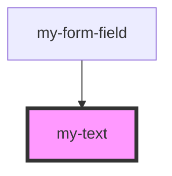

# my-text

<!-- Auto Generated Below -->

## Dependencies

### Used by

 - [my-form-field](../form-field)

### Graph

----------------------------------------------

*Built with [StencilJS](https://stenciljs.com/)*
